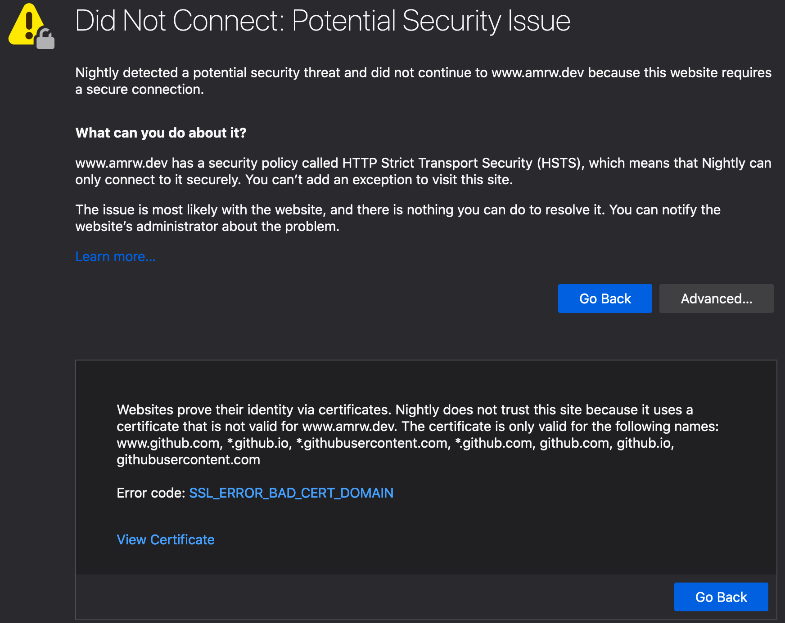

# Random Technical Issues

Uncategorised issues, such as ‘mouse doesn’t work in such and such scenario and here’s how to fix it’.

## Netflix full screen flicker on Mac Safari

1. Go to System Preferences -> Accessibility -> Display.
1. Change the cursor size. It can be put back to the original value, but the flicker will stop.

## [Autojump](https://github.com/wting/autojump) doesn't work

Autojump (`j <dir_name>`) alias may not work after a Shell migration. Try reinstalling the program:

```bash
brew reinstall autojump
```

If the above didn't help, make sure you have the appropriate preset in your relevant `.*rc` file:

```bash
[ -f /usr/local/etc/profile.d/autojump.sh ] && . /usr/local/etc/profile.d/autojump.sh
# Append to .zshrc, for instance:
[ -f /usr/local/etc/profile.d/autojump.sh ] && . /usr/local/etc/profile.d/autojump.sh >> ~/.zshrc
source ~/.zshrc
```

## [thefuck](https://github.com/nvbn/thefuck) doesn't work

thefuck (`fuck -y`) alias may be missing from the relevant `.*rc` file:

```bash
eval $(thefuck --alias)
# Append to .zshrc, for instance:
eval $(thefuck --alias) >> ~/.zshrc
source ~/.zshrc
```

## GitHub Pages instance with a custom domain doesn't load due to a bad certificate

If something similar to what's pictured below happens when trying to load a GitHub Pages instance with a custom domain, it requires some shenanigans that aren't quite supported by GitHub at the time of this writing.

<center></center>

A solution was to put the domain on Cloudflare (free tier) and enable a couple of rules. The idea and a guide was taken from [this message on a relevant forum post][1].

Steps to resolution ([source][2]):

1. Register on/log into Cloudflare.
1. Add the domain and follow the steps on the screen; especially those related to A and CNAME records.
1. Go to the domain's registrar and change the DNS's (domain name servers) to those Cloudflare provides during the setup. [Example steps for Namecheap.][3]
1. On Cloudflare, go to `SSL/TLS` settings of the domain and choose the `Flexible` mode.
1. Go to `Page Rules` and add an `Always Use HTTPS` rule with `http://*.example.com/*` as a value.
1. It should now work, but some browsers may still have troubles opening the page, or issue a warning regarding a cookie, even after waiting for a while. In such case, try clearing the cache for the page, especially the cookie.

[1]: https://github.community/t5/GitHub-Pages/Certificate-error/m-p/1724#M137
[2]: https://hackernoon.com/set-up-ssl-on-github-pages-with-custom-domains-for-free-a576bdf51bc
[3]: https://www.namecheap.com/support/knowledgebase/article.aspx/767/10/how-to-change-dns-for-a-domain

## Firefox: darken blank page/tab

_Tested on Firefox Nightly 73.0a1_

1. Visit `about:config`.
2. Change the `browser.display.background_color` variable to the desired hex colour.

Remember to confirm the change with the tick-box on the right – if successful, the variable name and value should be displayed in bold and the change will take effect immediately.

To also darken the flash of unstyled content before a page is loaded, create a `userChrome.css` stylesheet:

1. In the Firefox's menu go to `Help -> Troubleshooting Information`.
2. On the newly opened page locate `Profile Folder` row in the table. There will be a path to the current Firefox profile – copy it.

   ```bash
   cd "$(pbpaste)" # Beware leading and trailing spaces
   mkdir -p chrome
   [[ -f "./chrome/userChrome.css" ]] || touch ./chrome/userChrome.css
   echo '.browserContainer {\n\tbackground-color: #3d3d3d !important;\n}' >> ./chrome/userChrome.css
   ```
3. Restart Firefox.
